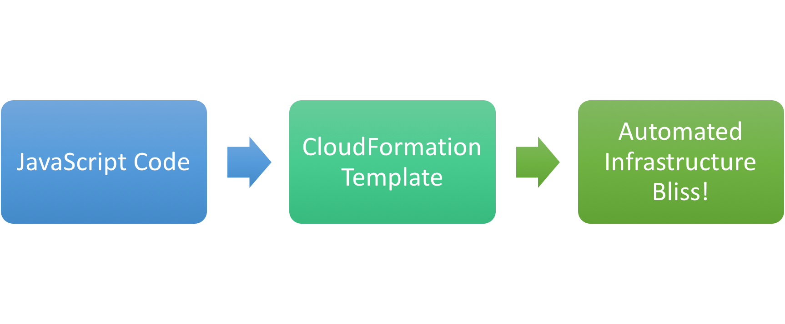

# AWS CF Generator Library

_Use JavaScript code to generate CloudFormation scripts for infrastructure automation_

## Motivation
While the promise of infrastructure automation via cloud formation is exciting, anyone who has spent a reasonable amount of actually writing/updating CloudFormation scripts has realized that the process can actually be quite painful. Specifically:

- The cloud formation scripts can get large and unweildy
- There are significant chunks of repitetive declarations (think API response mappings)
- It becomes increasingly hard to correctly maintain references between resources

This whole experience begs for a solution that relies more on code, and less on declarative markup for infrastructure.

## What Does This Library Do?
It allows you to declare all of your resources as a collection of JavaScript files, where each file emits a JSON snippet that corresponds to the CloudFormation template for the resource. Then, you can either use the [companion Grunt plugin](https://github.com/vamship/grunt-wysknd-aws-cf-generator), or write your own code (it's really easy) to generate a composite CloudFormation template that can be used to create and manage your AWS infrastructure.

## Learn More

- [Documentation](./docs/documentation.md)
